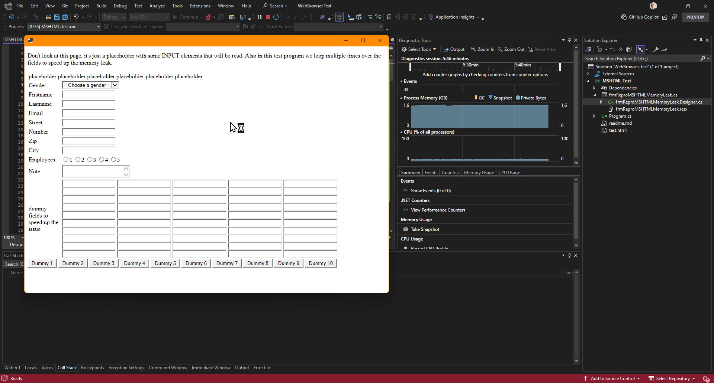
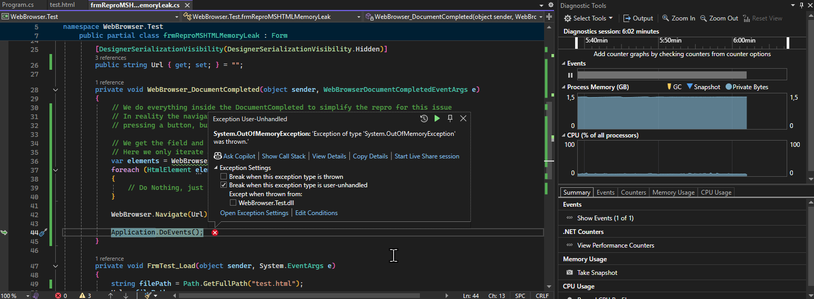
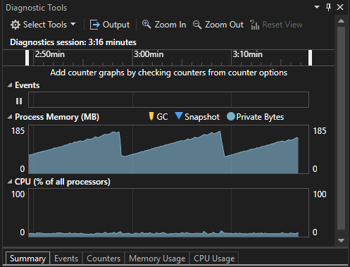

# MSHTML memory leak in NET9
## Versions used
- NET9.0.200
- 32-bits x86 executable
- Windows 11 24H2

## Background
We have a WinForms 32-bits call center application where customers report app crashes/hangs and they have to kill it, or it simply vanishes without any notification, which seems to coincide with our NET9 migration.
After restarting it just works again. This seems to happen every 1-1.5 hours (or 120-160 calls the processed) depending on the length of the calls mostly.

## Analysis
We noticed after going back to the version before the NET9 upgrade the issue vanishes so it seems related to NET9, or any changes in MSHTML for NET9?

After further investigation we noticed it is around 120-160 calls having been processed by the agent.
Our testing environment can fake calls and auto-process them so we could reproduce it by letting this testing environment run. It took around 30 minutes to crash.
On each call there is a navigate using an embedded MSHTML control to a start url for the call script. 
On each navigate we traverse the DOM, retrieving all INPUT, SELECT, LABEL and TEXTAREA elements and
filling them with data from our database.

Running in the debugger we sometimes get an out-of-memory exception, or the process just hangs, or closes like the production application. 
When running in the debugger the Diagnostic View shows memory increasing constantly. Since we run a win-x86 executable (for reasons :-| ) the crash occurs at 1.5-1.6GB of memory.

It seems this memory leak in combination with navigates in the MSHTML control and DOM traversals started with NET9, as running it with NET8 memory does not grow (at all) and can run all-day withou problems. 
In NET9 depending on the length of calls (ie. number of calls/hour) a crash happens after around 1-1.5 hours.

## Reproduction
We created a small test application that does the main things that lead to the memory leak/crash. This application will crash in about 5 minutes. See https://github.com/jbennink/repro-mshtml-memory-leak-net9

We also support WebView2, when switching to that browser engine the memory leak does not occur in NET9, which is obvious since it is completely different. However due to several customers running custom call scripts with 
embedded vbscript (yes really) we still have to support MSHTML, which itself is supported until 2029.

And returning to net8.0 the issue is also gone with MSHTML.

In instances the process continues running, but the window does not respond anymore, indicating that the embedded webbrowser has crashed internally. 
Memory does not increase in that situation either.
Also sometimes the process crashes with an out-of-memory exception where the VS debugger (Diagnostics view says the process memory is much less than 1,5GB) 
Most of the times it crashes when the Diagnostics windows says 1,6GB.

## Some images
This is what happens when the process just locks up:

Or in some cases we get an exception:

When switching to NET8 the same codes looks like this:

